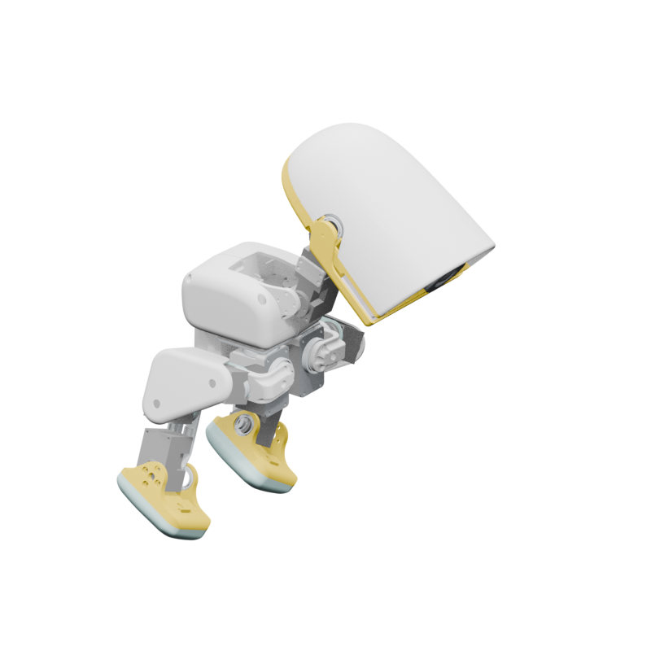
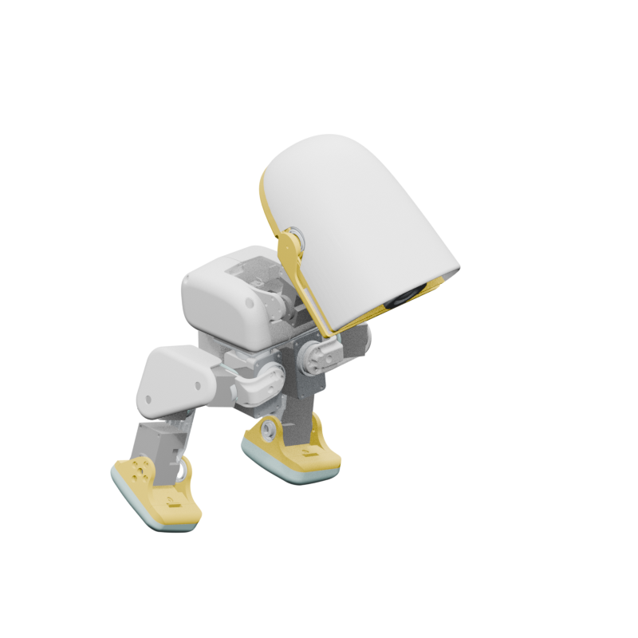
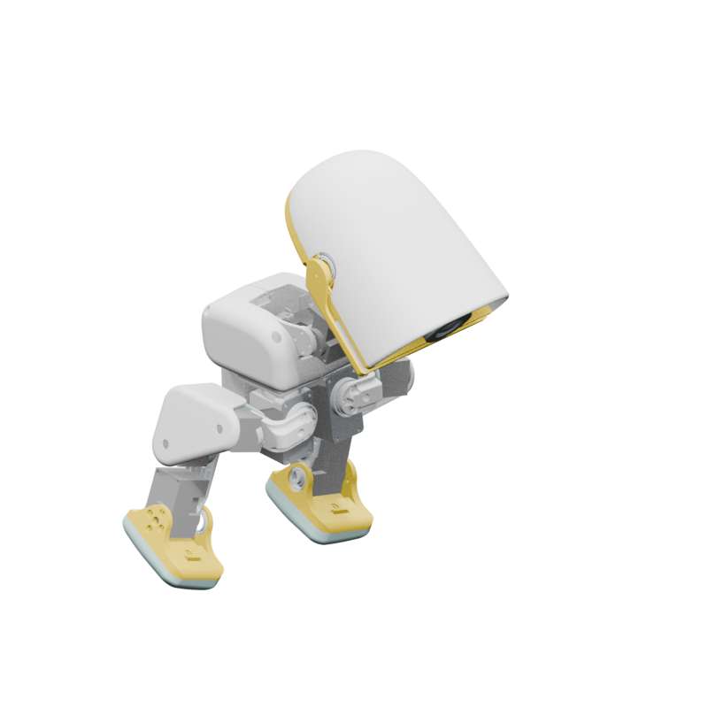

# 🦆 Open Duck Blender

<div align="center">


</div>

**Open Duck Blender** is a Blender rigging and animation environment for the small bipedal robot [**Mini Duck**](https://github.com/apirrone/Open_Duck_Mini), inspired by Disney’s BDX droid.

The project provides an FK/IK control system along with a reference data recording addon designed for training reinforcement learning policies.

Mini Duck remains available unchanged in `open-duck-mini.blend`. Microduck support
is generated separately from the canonical runtime and `microduck_rl` sources.

---

## Requirements & Installation

### Tested Environment

- **Blender ≥ 4.3.2**
- OS: Ubuntu (tested under 22.04)

> Older Blender versions have not been tested but should work.

### Installation steps

1. **Clone the repository**  
   ```bash
   git clone https://github.com/unergybot/Open_Duck_Blender.git
   cd Open_Duck_Blender
   ```
2. **Install git-lfs**
    ```bash
    git lfs install
    git lfs pull
    ```
3. **Open the Blender file**

Open `open-duck-mini.blend` in Blender.

> 💡 Both the FK/IK control addon and the data recording addon are preloaded and auto-enabled when you open the project.

<div align="center">


</div>

## Quick Start
1. Open open-duck-mini.blend in Blender 4.3.2+
> 💡 When first opening the project you might get a message *"For security reason, automatic execution of Python scripts in this file was disabled" because of the add-ons being started automatically. Check the option *"Permanently allow execution of scripts"* and click *Allow Execution* not to see the warning again.
2. The FK/IK control and Data Recorder tools are already enabled
3. Select the armature and enter Pose Mode
4. Use FK or IK bones to animate the legs. Head joints can also be controled, but only with FK for now
5. Develop your animation and use the panel to record and save joints data in the [desired format](https://github.com/apirrone/Open_Duck_reference_motion_generator/blob/11c3df93105d314c24702a2ea57e4bd103aea7c4/open_duck_reference_motion_generator/gait_generator.py#L291) for training

## Usage
### Animate with the Mini Duck rig

The Mini Duck rig includes two control systems for the legs, accessible with the **FK/IK Control** panel on the right:

- FK (Forward Kinematics): rotate each joint from top to bottom

<div align="center">


</div>

- IK (Inverse Kinematics): move the control bone and the rest follows. Changing the orientation of the control bone will change the orientation of the foot.

<div align="center">


</div>

> The first leg joint (*hip_yaw*) is controlled by FK and not IK.
GIF showing IK control

> Note that when switching from FK to IK, the foot orientation set in FK mode might not be preserved, this is a known current limitation of the IK system tha will be addressed in future updates.


You can switch between these control modes to create animations.

For now, the **head** can only be animated using FK.

### Snapping between FK and IK
<details>
<summary>❓ Why is snapping needed?</summary>
<br>
When animating in Blender, FK and IK cannot be used simultaneously on the same limb.
Switching between them without snapping causes the pose to jump or break.

The included control addon ensures a seamless transition between the two systems.
</details>

<br>

### Walk cycle example
A simple walk cycle is included in the project. You can find it in the timeline at frame 1 in Pose mode after selecting bones.

<div align="center">


</div>

## Recording Data for Reinforcement Learning
The data recorder addon automatically starts the recorded animation and logs joints data until the animation ends.

> 💡 Make sure that the animation is not running when pressing the *Start Recording* button

📁 Where is the data saved?

Recording is saved to *\<your Blender install directory>/duck_mini_data_records/* (the directory is created if it does not exist).

### Replay Recorded Data
You can replay the recorded with the script [ref_motion_viewer_episodic.py](https://github.com/apirrone/Open_Duck_Playground/blob/episodic/playground/open_duck_mini_v2/ref_motion_viewer_episodic.py) from Open_Duck_Playground (for now the replay is only available in the episodic branch).

```bash
# Install the Open Duck Playground repository
git clone https://github.com/apirrone/Open_Duck_Playground/tree/main
git checkout episodic
# Install uv
curl -LsSf https://astral.sh/uv/install.sh | sh
# Start the replay script
cd Open_Duck_Playground
uv run playground/open_duck_mini_v2/ref_motion_viewer_episodic.py --reference-data <path_to_your_recorded_data>
```

### Use recorded data to train RL policies
TODO

## Microduck project generation

The Microduck project targets the 14 policy joints and 15 MJCF bodies at 50 Hz.
It includes FK/IK leg controls, an articulated mouth control, Cream/Graphite/
Lavender/Sky colourways, and native `.npz` export for `microduck_rl`.

The public MJCF/STLs do not contain the complete grasping-beak mechanism. The
[official Microduck site](https://pollen-robotics.com/microduck/) describes an
articulated beak, while its press kit states that the mechanical hardware is not
open source. By default the generator therefore creates a clearly marked,
image-derived single-hinge presentation rig. It is suitable for animation but
not a mechanically validated grasp simulation. An authorized CAD/mates export
matching `assets/microduck/mouth-linkage.schema.json` replaces the approximation.

Clone the three `unergybot` forks as siblings under `~/MyCode`:

```bash
cd ~/MyCode
git clone https://github.com/unergybot/microduck.git
git clone https://github.com/unergybot/microduck_rl.git
git clone https://github.com/unergybot/Open_Duck_Blender.git
```

Generate the Blender project from those explicit fork checkouts:

```bash
cd ~/MyCode/Open_Duck_Blender
blender --background --factory-startup \
  --python tools/build_microduck_blend.py -- \
  --runtime-root ~/MyCode/microduck \
  --rl-root ~/MyCode/microduck_rl
```

Append `--mouth-linkage /path/to/authorized-mouth-linkage.json` when the
authoritative package is available.

This writes `microduck-alpha.blend`. Open it with automatic Python execution
allowed, animate the selected armature, then use **Open Duck → Export mjlab
Motion**. Validate the result from the `microduck_rl` checkout:

```bash
cd ~/MyCode/microduck_rl
uv run scripts/validate_blender_motion.py /path/to/motion.npz
```

The validator checks the schema, exact joint/body ordering, 50 Hz metadata,
finite arrays, and replays every frame through the canonical MuJoCo model.

### Import a policy rollout into Blender

Export a motion archive from the sibling `microduck_rl` checkout first:

```bash
cd ~/MyCode/microduck_rl
uv run scripts/export_policy_rollout.py \
  ~/MyCode/microduck/policies/alpha_walking.onnx \
  --output /tmp/alpha-walking-forward.npz \
  --duration 4 \
  --lin-vel-x 0.30 \
  --seed 0
uv run scripts/validate_blender_motion.py /tmp/alpha-walking-forward.npz
```

Open `microduck-alpha.blend`, select the Microduck armature, and choose **Open
Duck → Import mjlab Motion** in the 3D View sidebar. Pick the generated `.npz`
file. Leave **Action Name** empty to use a deterministic name derived from the
file name, or set it before importing to choose the action name. The imported
action becomes active, preserves the archive's root translation and rotation,
and sets the scene to the archive frame range at 50 Hz. Importing never changes
`duck_mouth_open`: the articulated mouth is visual-only and excluded from the
14-joint policy archive. Use **Open Duck → Export mjlab Motion** to export the
active imported action again.

### Policy walking milestone

`microduck-alpha.blend` ships with `Policy_alpha_walking_forward`, a
deterministic 200-frame, 50 Hz action generated from `alpha_walking.onnx` with
the forward command set to `0.30 m/s`. The action preserves simulated root
motion and advances approximately `0.487 m` over four seconds. The rollout uses
four 5 ms MuJoCo substeps per frame and records a canonical configuration digest
alongside the policy and scene hashes.

| Frame 1 | Frame 100 | Frame 200 |
| --- | --- | --- |
|  |  |  |

`microduck-alpha.blend` includes a 51-frame neutral-to-crouch-to-neutral test
action. Its verified export is stored at
`assets/motions/microduck-crouch-test.npz`; the animated mouth is visual-only
and remains outside the 14-joint policy archive.

For a headless acceptance check, rebuild to a temporary path, open the result,
export frames 1–51 with **Open Duck → Export mjlab Motion**, then run the
validator above. A valid archive reports 51 frames and sub-micrometre forward-
kinematics errors.
